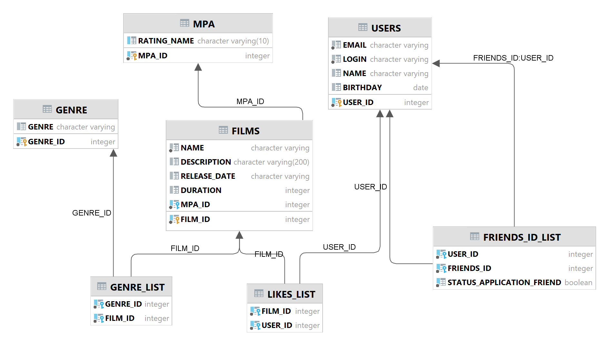

# java-filmorate
Template repository for Filmorate project.



Примеры запросов для основных операций:

### <span style="color: green"> 1. Фильмы:</span>

1.1. GET .../films - получение всех фильмов
```
SELECT * 
FROM FILMS;
```
1.2. GET .../films/{id} - получение каждого фильма по их уникальному идентификатору
```
SELECT * 
FROM FILMS
WHERE id = {id};
```
1.3. GET .../films/popular?count={count} - возвращает список из первых count фильмов по количеству лайков
```
SELECT
    FL.FILM_ID,
    COUNT(USER_ID) AS LIKES,
    F.FILM_ID, NAME, DESCRIPTION, RELEASE_DATE, DURATION, M.RATING_NAME, G.GENRE, RATE
FROM LIKES_LIST as FL
JOIN FILMS F on F.FILM_ID = FL.FILM_ID
JOIN GENRE G on G.GENRE_ID = F.GENRE_ID
JOIN MPA M on F.MPA_ID = M.MPA_ID
GROUP BY FL.FILM_ID
ORDER BY LIKES DESC
LIMIT 10;
```
1.4. POST .../films - добавление фильма
```
INSERT INTO FILMS (NAME, DESCRIPTION, RELEASE_DATE, DURATION, MPA_ID, GENRE_ID, RATE) 
VALUES ('New film', 'New film about friends', '1999-04-30', 120, 2, 3, 4);
```
1.5. PUT  .../films/{id} - обновление фильма
```
UPDATE FILMS t SET 
t.NAME = 'Film Updated', 
t.DESCRIPTION = 'New film update decription', 
t.RELEASE_DATE = '1989-04-17', 
t.DURATION = 190, 
t.GENRE_ID = 2 
WHERE t.FILM_ID = {id};
```
1.6. PUT  .../films/{id}/like/{userId} — пользователь ставит лайк фильму
```
INSERT INTO LIKES_LIST (FILM_ID, USER_ID) 
VALUES ({id}, {userId});
```
1.7. DELETE .../films/{id}/like/{userId} — пользователь удаляет лайк
```
DELETE FROM LIKES_LIST 
WHERE FILM_ID = {id} AND USER_ID = {userId};
```
### <span style="color: blue"> 2. Пользователи:</span>

2.1. GET .../users - получение списка всех пользователей
```
SELECT *
FROM USERS;
```
2.2. GET .../users/{id} - получение каждого пользователя по их уникальному идентификатору
```
SELECT * 
FROM USERS 
WHERE USER_ID = {id};
```
2.3. GET .../users/{id}/friends — возвращаем список пользователей, являющихся его друзьями
```
SELECT * 
FROM FRIENDS_ID_LIST 
WHERE USER_ID = {id};
```
2.4. GET .../users/{id}/friends/common/{otherId} — список друзей, общих с другим пользователем
```
SELECT *
FROM USERS
WHERE USER_ID IN (
    SELECT FRIENDS_ID 
    FROM FRIENDS_ID_LIST 
    WHERE FRIENDS_ID_LIST.USER_ID = {id})
INTERSECT
SELECT *
FROM USERS
WHERE USER_ID IN (
    SELECT FRIENDS_ID 
    FROM FRIENDS_ID_LIST 
    WHERE FRIENDS_ID_LIST.USER_ID = {otherId});
```
2.5. POST .../users - создание пользователя
```
INSERT INTO USERS (EMAIL, LOGIN, NAME, BIRTHDAY)
VALUES ('friend@mail.ru', 'friend', 'friend adipisicing', '1978-08-20');
```
2.6. PUT .../users/{id} - обновление пользователя
```
UPDATE USERS t 
SET t.EMAIL = 'update@mail.ru', 
t.NAME = 'update adipisicing' 
WHERE t.USER_ID = {id};
```
2.7. PUT .../users/{id}/friends/{friendId} — добавление в друзья
```
INSERT INTO FRIENDS_ID_LIST (USER_ID, FRIENDS_ID, STATUS_APPLICATION_FRIEND) 
VALUES ({id}, {friendId}, true);
```
2.8. DELETE /users/{id}/friends/{friendId} — удаление из друзей
```
DELETE 
FROM FRIENDS_ID_LIST 
WHERE USER_ID = {id} 
AND FRIENDS_ID = {friendId} 
AND STATUS_APPLICATION_FRIEND = true;
```